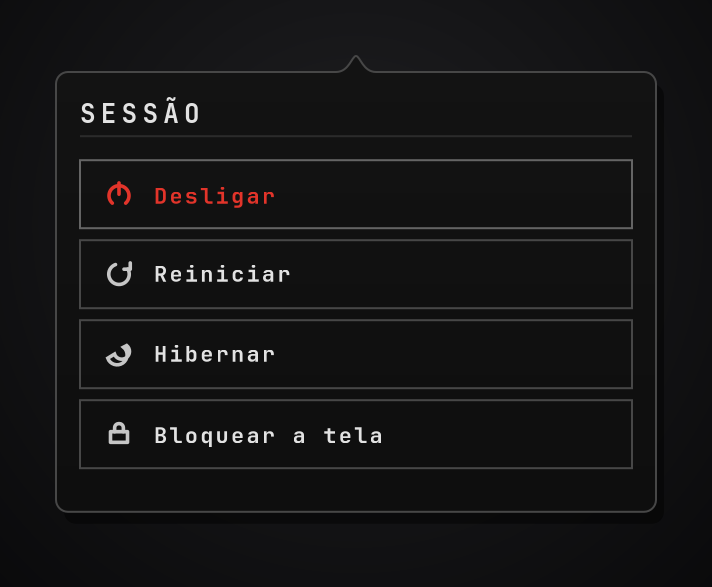

# Session

Session menu on the QS Bar: shut down, reboot, hibernate, or lock the screen.



## What it does

- **Widget** — a power glyph on the QS Bar. A click only opens the session panel;
  the glyph never runs an action by itself.
- **Panel** — Shut Down, Restart, Hibernate, Lock screen. Labels follow the
  system locale (English source strings; Portuguese in `content/I18n.qml`).
  Escape or click outside dismisses via the host `PluginPanel`.
- **Service** — on an explicit panel row tap, runs one of the declared commands
  below, then closes the panel.

No mutation ever happens on a bar-mark click.

## Install

From this repository on a Ryoku desktop:

```
ryoku plugin validate .
ryoku plugin add . --bar --yes
```

Or install from **Ryostore → Plugins** once it is listed. Enable and place it
under **QS Bar Settings → Community**.

## How it plugs in

The shell owns the bar host and the panel card. This plugin ships:

- `service/Main.qml` — headless session actions (`systemctl` / `ryoku-shell`).
- `content/Widget.qml` — the bar glyph (`density: glyph`); click calls
  `pluginApi.togglePanel()`.
- `content/Panel.qml` — the session list (`density: full`); rows call the
  service, then `pluginApi.closePanel()`.
- `content/I18n.qml` — plugin-local translations (R4 forbids shell I18n).

`hosts` is `topbarGlyph` only; `defaults.host` is `topbarGlyph`.

## Settings

None. `metadata.settings` is empty.

## What it runs

Every external command, and exactly when (only after a panel row tap):

| Command | When |
| --- | --- |
| `systemctl poweroff` | Shut Down |
| `systemctl reboot` | Restart |
| `systemctl hibernate` | Hibernate |
| `ryoku-shell lock` | Lock screen (same path as Super+L / native quick settings) |

## What it never does

- No network access.
- No privileged escalation (`pkexec` / `sudo` / `doas` / `su`).
- No writes under the plugin state dir, cache, or elsewhere.
- No compositor-specific tools (`hyprctl`, etc.).

## Requirements

- A running Ryoku shell with `Ryoku.PluginKit`.
- `systemctl` and `ryoku-shell` on `PATH` (declared in `dependencies.commands`).

## Source

Canonical / public source:
[https://github.com/leandrofelix-dev/power-button](https://github.com/leandrofelix-dev/power-button)

Local development clone (optional): `~/Work/power-button`.

## Where it lists

Community plugin (`official: false`). It appears under **QS Bar Settings >
Community** with the store's community warning, its author, and its switch.

## Develop

```
power-button/
  manifest.json             # id, version, hosts, entry points, files
  service/Main.qml          # main: session actions
  content/Widget.qml        # bar glyph
  content/Panel.qml         # session panel
  content/I18n.qml          # en / pt / pt_BR labels
  assets/preview-widget.png # README / Store preview
  LICENSE                   # MIT
```

## Maintenance & safety

Session is a community contribution. Its author maintains and updates it — not
the Ryoku team. Ryostore screens submissions against the plugin rules, but
screening is a safeguard, not a guarantee: review what a plugin does before
enabling it.

## Credits

Felix \<eu@leandrofelix.dev.br\>. MIT licensed. See [LICENSE](LICENSE).
